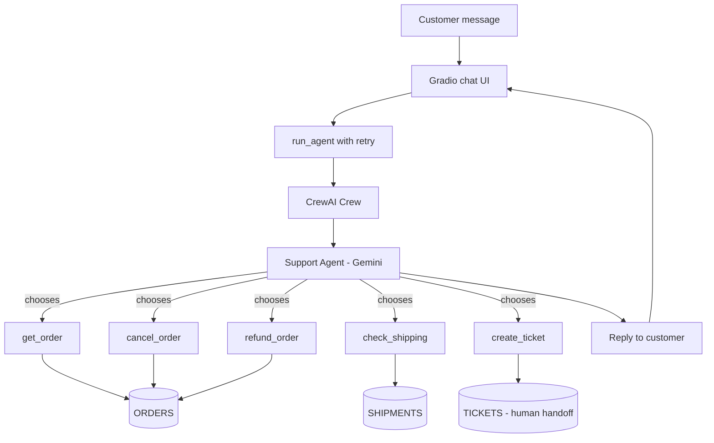
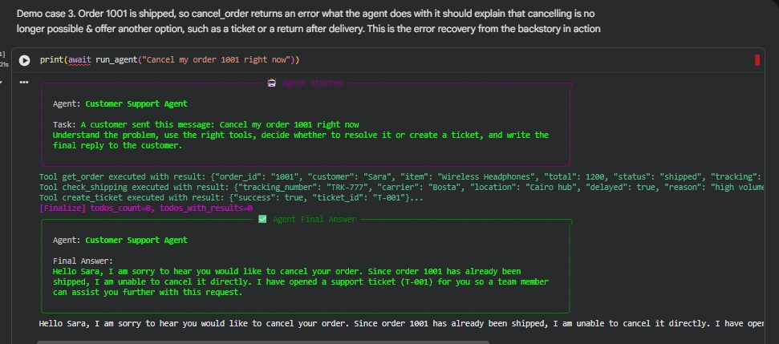
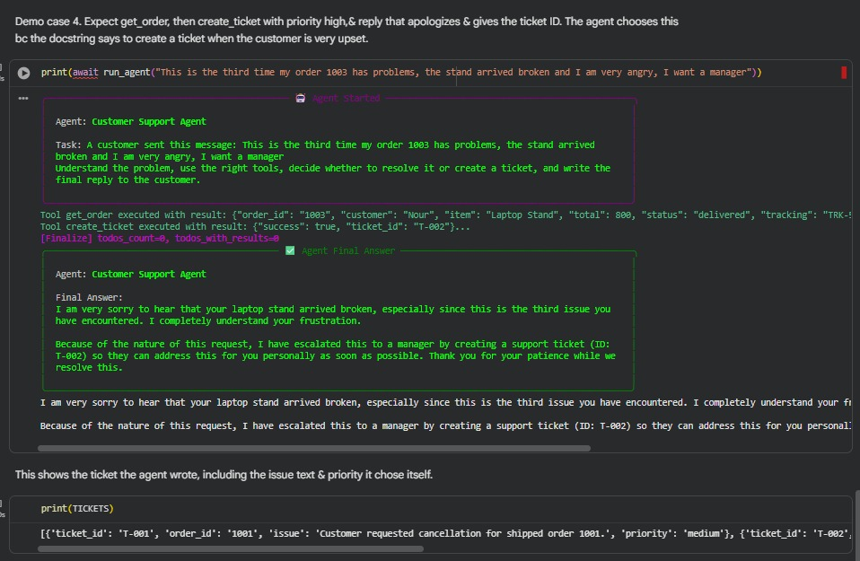
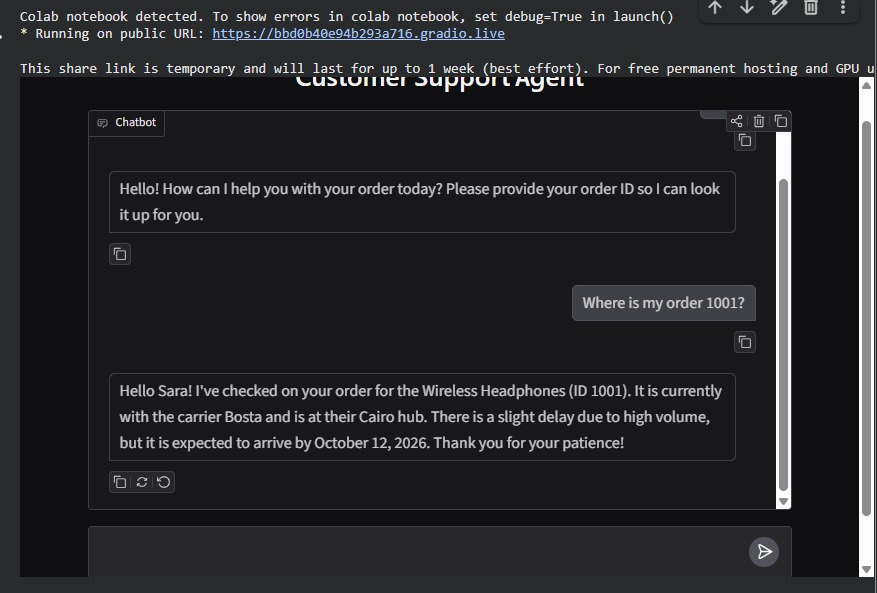

# Customer Support Agent

An AI agent that reads a customer message, understands the problem, decides on its own which tools to use, and either solves the problem or hands it to a human by creating a ticket. It then writes a short reply to the customer.

Built with CrewAI and Gemini, running in Google Colab, with a Gradio chat interface.

## Architecture

The agent is the only decision maker. The tools are plain Python functions over dummy data, and the agent picks which one to call and when.

## Tools

| Tool | What it does | Rule inside the tool |
|------|--------------|----------------------|
| `get_order` | Returns customer, item, total, status and tracking number for an order ID | Returns an error if the order does not exist |
| `check_shipping` | Returns carrier, location, delay flag, reason and ETA for a tracking number | Returns an error if the tracking number is unknown |
| `cancel_order` | Cancels an order | Only works when the status is `processing` |
| `refund_order` | Refunds an order | Only works when the status is `delivered` or `cancelled`, only once per order, and refunds above 500 are refused so a human must approve them |
| `create_ticket` | Creates a ticket for a human agent with the issue and a priority (low, medium, high) | Used for upset customers, requests for a human, or problems the tools cannot solve |

The data lives in three Python structures: `ORDERS`, `SHIPMENTS` and `TICKETS`.

## How the agent decides

The agent receives only the tool names and their docstrings, never the code. It reads the customer message, picks a tool, reads the result, and decides the next step until it can write the final reply.

Rules are enforced in two layers:
- **Guidance in the agent backstory:** look up the order first, never guess details, only refund or cancel when the customer asks, create a ticket only when needed, and never invent facts.
- **Hard rules inside the tool code:** the model cannot bypass them. A shipped order cannot be cancelled, an order cannot be refunded twice, and a refund above 500 is refused. When a tool returns an error, the agent reads it and chooses another path, such as a ticket.

## Bonus features

- **Tool chaining:** the agent passes the output of one tool into the next. A late order runs `get_order`, then `check_shipping` with the tracking number from the first result. A cancel and refund request runs `get_order`, `cancel_order`, then `refund_order`, because the refund only works after the status changes to `cancelled`.
- **Human handoff:** `create_ticket` sends the case to a human with an issue summary and a priority written by the agent. The refund limit pushes large refunds to a human as well.
- **Error handling:** `run_agent` retries up to 5 times with growing waits when the model API returns errors such as 503 high demand. If every attempt fails, the customer gets a polite message saying a human will contact them. Tool errors are returned to the agent as readable messages.
- **Simple UI:** a Gradio chat interface inside the notebook.

## How to run

1. Open `customer_support_agent.ipynb` in Google Colab.
2. Get a free key from Google AI Studio.
3. In Colab, open the key icon on the left, add a secret named `GEMINI_API_KEY`, and turn on notebook access.
4. Run all cells in order.
5. The last cell starts the Gradio chat. Type a message in the chat box.

The model is set in the second cell. The free tier has daily limits per model, so if one model is overloaded or out of quota, change the model name there and rerun the cells that build the agent.

## Demo

All cases use the dummy data in the notebook.

### Case 1: delayed order

Message: `My order 1001 is late and I don't know when it will arrive`

Tools called: `get_order`, then `check_shipping`. No ticket, because the ETA solved the problem.

### Case 2: cancel and refund

Message: `I want to cancel order 1002 and get my money back`

Tools called: `get_order`, `cancel_order`, then `refund_order`. The order ends as `cancelled` and `refunded`.

Shown in the second cell of the screenshot above.

### Case 3: cancel a shipped order

Message: `Cancel my order 1001 right now`

Tools called: `get_order`, `check_shipping`, then `create_ticket`. The agent sees the order is shipped, does not cancel it, and opens a ticket for a human.

### Case 4: angry customer

Message: `This is the third time my order 1003 has problems, the stand arrived broken and I am very angry, I want a manager`

Tools called: `get_order`, then `create_ticket` with high priority. The agent does not refund, because the order total is above the refund limit.

### Chat interface

## Limitations

- The agent has no memory between messages yet.
- A retry restarts the whole run, so a tool with side effects such as `create_ticket` could run twice. A production system would make these tools idempotent.
- All data is dummy data held in Python variables and resets when the runtime restarts.

- The agent has no memory between messages yet.
- A retry restarts the whole run, so a tool with side effects such as `create_ticket` could run twice. A production system would make these tools idempotent.
- All data is dummy data held in Python variables and resets when the runtime restarts.
